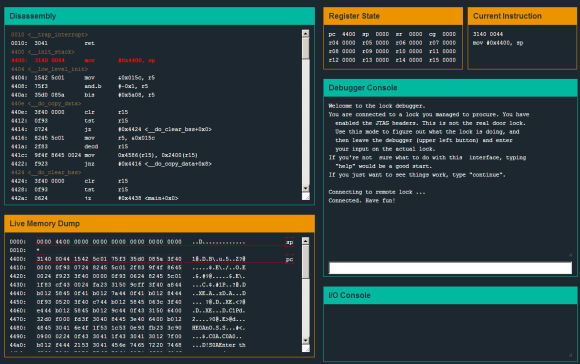

# Level 1: Tutorial

[MicroCorruption](http://microcorruption.com/) is a "game" made by **Matasano** in which you will have to debug some programs in **assembly**. There is a total of 19 levels and they get harder and harder, teaching you about more advanced attacks and ways of mitigating them. The first levels are easy and there is even a tutorial that takes you step by step into this world. It is a great tool to learn and I would even say a great game to play. As I had never done any **asm** (assembly) prior to this, I will try to document my journey in this challenge.