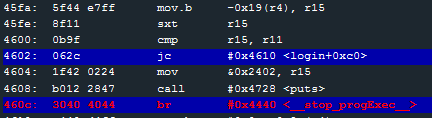
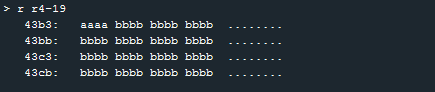
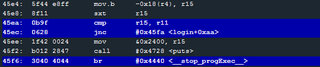
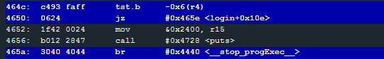

# Level 10: Santa Cruz

## First protection

We try entering a long username and password and we get directly kicked out of the program at line 460c. The program seems to check address r4-19 (0x43b3) and compare it with r11. If it doesn't match then it exits.

**The r11 register seems to hold the password length.**

`jc` Jump on Carry, similar to Jump if Below (*JB*) or Jump if Not Above or Equal (`JNAE`)

We can circumvent that if what is at address `0x43b3` is **below than the password's length**.

We check this address to see that it's overflowed by the **username** we entered. We can set the 18th byte of the username to something lower than the password length and it will pass the test.

>here I entered a series of *a*'s as username, and a series of *b*'s as password.

## Second protection

We get kicked a second time but at a different line (45f6).

`jnc` Jump No Carry, equivalent to Jump if Not Below (JNB)  or **Jump if Above or Equal** (JAE). So we jump if the byte at address `0x43b4` **is not below the password's length**. This address can be modified by the 19th byte of the username.

>Note that the initial values are respectively 8 and 10, meaning that they expected us to enter a password greater than 8 and lesser than 11 characters.

## Third protection

We get halted one last time at line 0x465a.

`tst.b -0x6(r4)`: if the byte at address r4 - 6 (`0x43c6`) is not zero, it will exit. This is very important as this is one of the first occurence of a real world way to prevent attacks on a program. It is called a **Canary**. It checks for values in the code and detect buffer overflows if the value is incorrect. Here it checks the byte we overflowed with the 18th byte of the password we entered.

Thus, this combination of username and password should pass the three tests we described:

## Stack Overflow

We passed all the test and couldn't produce a stack overflow with the password. Did I miss something? Let's try with the username

username: aaaaaaaaaaaaaaaaaaaaaaaaaaaaaaaaaa01ffaaa [...] aaa
password: bbbbbbbbbbbbbbbbbbbbbbbbbbbbbbbbbb00

That's the solution. The Stack Pointer points to some remains of the username right before executing the last `ret` of our program. We can now do a stack overflow by modyfing the 43th byte of the username to the address we want to jump to.

We use the 7F call interrupt technique of the previous challenge.

username: aaaaaaaaaaaaaaaaaaaaaaaaaaaaaaaaaa01ffaaaaaaaaaaaaaaaaaaaaaaaaaaaaaaaaaaaaaaaaaaaaaa72447f
password: bbbbbbbbbbbbbbbbbbbbbbbbbbbbbbbbbb00

**It works!**
