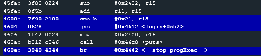
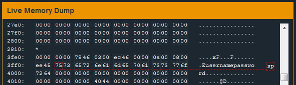
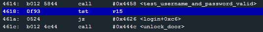
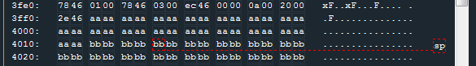

# Level 11: Jakarta

## First protection

Entering different usernames we see that **r11 is the username's length**.
Look at the instruction `cmp.b #0x21, r11` 

>`jnc` ~ Jump if Above or Equal

So we pass the first test if **the username's length is lesser than 33 bytes** (0x21).

## Second protection

`add r11, r15`
`cmp.b #0x21, r15`
`jnc`

So **the sum of the username and the password lenghts** have to be lesser than 33 bytes as well (0x21).

## Stack Overflow

We see that the username and the password are stored in the stack thanks to the `strcpy`.

We see that the password is tested in the function `test_username_and_password_valid` through the 7d interrupt. So we cannot do anything here. It is obvious we need to create a stack overflow again.

But let's go back to our previous tests

Don't you see something? `cmp.b #0x21, r15`.
This means: compare byte of r15 and 0x21. But words are 2 bytes in MSP430 (so registers and address in the stack are 2 bytes).
What if we wrote 0x1020 for example. Would it be lesser than 0x21 ?

Let's try that.

I enter `aaaaaaaaaaaaaaaaaaaaaaaaaaaaaaaaaaaaaaaaaaaaaaaaaaaaaaaaaaaaaaaa` (length of 0x20) as username.

we want the toal to be 0x0100 to test our hypothesis. So we need 0xd0 more (14 * 16 = 224 bytes).

Entering `bbbbbbbbbbbbbbbbbbbbbbbbbbbbbbbbbbbbbbbbbbbbbbbbbbbbbbbbbbbbbbbbbbbbbbbbbbbbbbbbbbbbbbbbbbbbbbbbbbbbbbbbbbbbbbbbbbbbbbbbbbbbbbbbbbbbbbbbbbbbbbbbbbbbbbbbbbbbbbbbbbbbbbbbbbbbbbbbbbbbbbbbbbbbbbbbbbbbbbbbbbbbbbbbbbbbbbbbbbbbbbbbbbbbbbbbbbbbbbbbbbbbbbbbbbbbbbbbbbbbbbbbbbbbbbbbbbbbbbbbbbbbbbbbbbbbbbbbbbbbbbbbbbbbbbbbbbbbbbbbbbbbbbbbbbbbbbbbbbbbbbbbbbbbbbbbbbbbbbbbbbbbbbbbbbbbbbbbbbbbbbbbbbbbbbbbbbbbbbbbbbbbbbbbbbbbbbbbbbbbbbbbbbbbbbbbbbbbbbbbbbbbbbbb` it works and we get lost at a random address. We've successfully overwrote the return address.

Breaking on the return instruction we can see at what address the Saved PC is (at the SP address).

So we can enter our personalized return address at the byte number 5 and 6 of our password (if our username is of length 0x20 of course). Let's return at the instruction `unlock_door`.

So entering the same username, and this as password works:

`bbbbbbbb1c46bbbbbbbbbbbbbbbbbbbbbbbbbbbbbbbbbbbbbbbbbbbbbbbbbbbbbbbbbbbbbbbbbbbbbbbbbbbbbbbbbbbbbbbbbbbbbbbbbbbbbbbbbbbbbbbbbbbbbbbbbbbbbbbbbbbbbbbbbbbbbbbbbbbbbbbbbbbbbbbbbbbbbbbbbbbbbbbbbbbbbbbbbbbbbbbbbbbbbbbbbbbbbbbbbbbbbbbbbbbbbbbbbbbbbbbbbbbbbbbbbbbbbbbbbbbbbbbbbbbbbbbbbbbbbbbbbbbbbbbbbbbbbbbbbbbbbbbbbbbbbbbbbbbbbbbbbbbbbbbbbbbbbbbbbbbbbbbbbbbbbbbbbbbbbbbbbbbbbbbbbbbbbbbbbbbbbbbbbbbbbbbbbbbbbbbbbbbbbbbbbbbbbbbbbbbbbbbbbbbbbbbbbbbbbbbbbbbb`