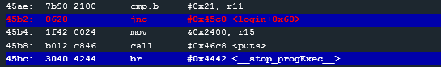

# Level 11: Jakarta

## First protection

line 45bc stops us.
Entering different usernames we see that **r11 is the username's length**.
Look at the instruction `cmp.b #0x21, r11` 

>`jnc` ~ Jump if Above or Equal

So we pass the test if **the username's length is lesser to 21**.

aaaaaaaaaaaaaaaaaaaaaaaaaaaaaaaaaaaaaaaa should work.

## Second protection

`add r11, r15`
`cmp.b #0x21, r15`
`jnc`

So the sum of the username and the password lenghts have to be lesser than 0x21 (33).

bbbbbbbbbbbbbbbbbbbbbbbbbbbbbbbbbbbbbbbbbbbbb