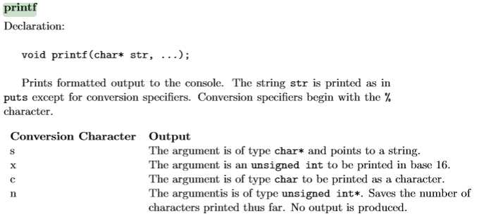
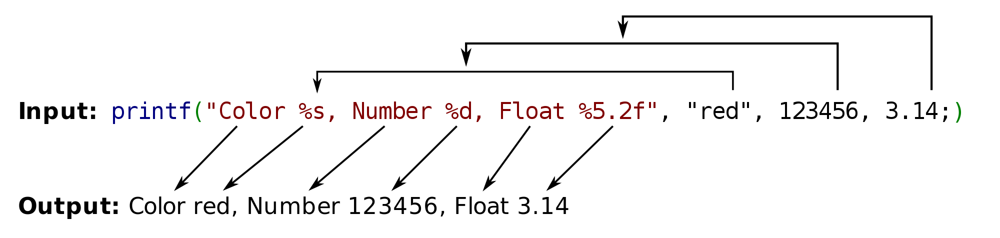
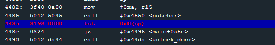

# Level 12: Addis Ababa

## Quick observations

* The password is tested through `test_password_valid` with a 7d interrupt (HSM Model 1).
* We have an `unlock_door` function (so no need to go through the `test_password_valid` function if we can return to it).(44da)
* We have no `ret` after the main (so we can't modify the return address).
* If the SP is different from zero the program unlocks the doors.
* We have a printf of our username (**format string vulnerability**!)

## Printf in Manual

We see that printf is a limited version of the C equivalent. Since we have %n available we know we can write to the memory and thus we should be able to do a Format String exploit.

So here the developer did a:

`printf(user_input);`

instead of this: 

`printf("%s", user_input);`

So the user_input becomes the format string and it will look in the stack for its arguments (in the example red, 123456, and ... are pushed in the stack).

## Printf in MSP430

Let's try `%x` as input. It doesn't output anything. So the first argument must be null:

`printf(user_input, 0x00);`

Let's try again with `%x %x`. It outputs `7825` which is `%x` reversed (little endian). It seems like when we point to our second arguments we are pointing to the beginning of our input. Since a word is 16bits in MSP430 we only display 2 characters in hexadecimal.

So if we enter `PTR%x%n` we will write 5 to the address in PTR.
note that we can use %x, %c, %n... as our first format since we won't use it.

## Exploit

Remember what we observed at the begginning:

> If the SP is different from zero the program unlocks the doors.

It was at this line. And by breaking on it we can see that sp is pointing to 3062.

So let's try to do `6230256e256e`

which should write the number of characters printed before the last %n (which will be only 2 since the first %n won't count).