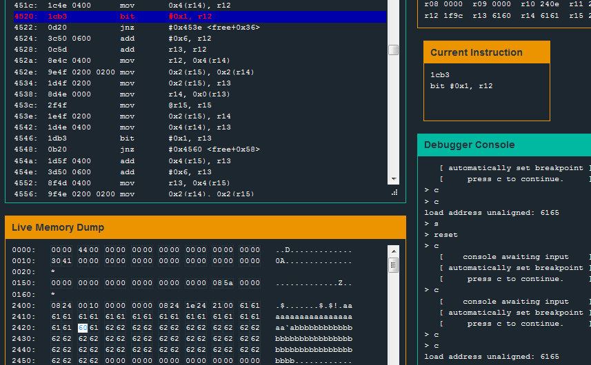
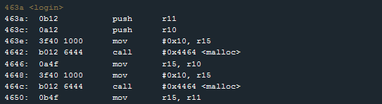
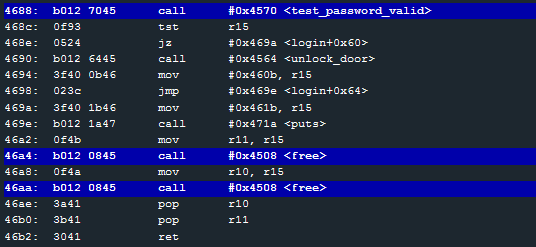
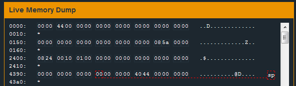
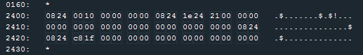
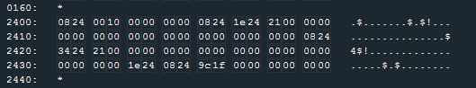
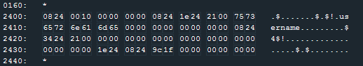
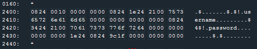
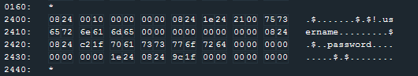
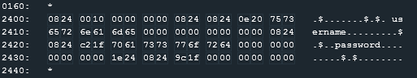

# Level 14: Algiers


## Observations

* Use of the **malloc** function. Hints at a **Heap Overflow Exploit**.
* There are two functions that can unlock this level:  `unlock_door` and `test_password_valid`.
* There seem to be no check on the username and password length. We can enter 18 bytes in username and then it gets overwritten by password.
* With a quick test entering a long string of the same letter as username and as password we get an error : **load address unaligned: UU75** where UU is the character we entered in the username.
* One character in username input gets changed to ` during the password verification (at address 2422 in memory).
* The buffer overflow stops us at line 0x4520 (in the `free` function).



In the Manual we find: 

> BIT arg1 arg2 -> compute arg1 & arg1, set the flags, and discard the results (like TEST on x86)

Also it seems good to keep being aware that in MSP430 the Heap grows toward the Stack and the Stack towards the Heap.

0000 low addresses
HEAP v

STACK ^
Text v
ffff high addresses

## login



Looking at the login function we see that it's doing two malloc of size 10 and is storing the username in the first malloc contained at r10, and the password in the second malloc r11.

After retrieving the user's credentials and storing them in the heap. The program calls `test_password_valid` and unlocks the door or not according to the validity of the username and the password.

Looking at the test_password_valid we see an early `ret` followed by a long list of what seems like gibberish opcodes.



Later the login function frees the two mallocs.

But let's see what really happens. We can see the heap before the mallocs:



The heap after the first malloc:



The heap after the second malloc:



The heap after entering "username" as username:



The heap after entering "password" as password:



Here we can see the memory after the first free:



And the memory after the second free:




## Heap Structure.


The Heap is a **doubly-linked list**. Each chunk is composed of **metadatas** and a **payload**. The chunks are wraped with a heap header and a heap footer. Here we can see the structure of a chunck:

```
0824 | 1e24 | 21 00 | username | 00...
 bk  |  fw  | flag  | payload  | padding
```

And what is interesting:

* bk (backward): a pointer to the previous chunck
* fw (forward): a pointer to the next chunck

The second chunck starts at address `241e` and contains the password. The idea of a heap overflow is to **overwrite the metadatas** of this second chunck when filling the payload of the first one. Because when free is called to remove this chunck, it will do some magic with the fw and bk pointers so the chain can reconstruct around the chunck.


## Try to exploit this

So let's change overwrite the second chunck with our username input. I tried multipled things:
* Set fw to the saved pc in the stack right before the return of the login function, set bk to the address where login calls unlock_door.
* Set fw to the address being called in the second free, set bw to the unlock_door function.
* Set fw to the instruction return in the free function, set bw to Nops so we would go directly in the unlock_door function afterwards.

It failed for different reasons. It was overwritting things at the bw pointer. It was not working because of parity problems. Reversing the function did help understand that what we would point with fw would influence the overwriting.

Here is a smart reverse of the function `free`. It was thought so I could see how changing bk, fw and the flag would influence the free. So this is not exactly what the free function does! I also remove useless lines.

```
exploitable_free(*bk, *fw, *flag){
	// the flag is modified if not even
	if(*flag % 2 == 1)
		*flag = *flag - 1;
	r14 = bk;
	r12 = *(bk + 4);

	// we do this if the previous chunk's flag is even
	// which is not because it's not the first one?
	if(r12 % 2 == 0){
		// not executed
	}

	r14 = fw;
	r13 = *(fw+4);

	// r13 : 1f9c (dunno if we can rewrite that far away)
	// c : 1100
	// so we do this if
	if(r13 % 2 == 0){
		*flag = r13 + *flag + 6;
		fw = *(r14+2); // interesting!
		*fw = bk;
	}

	return;
}
```

In the end I tried to make a shell code. I copied the instructions in unlock_door:

```
3012 7f00 b012 b646 fd3f
```

And I pointed the saved pc to the heap (which is supposed to be non-executable on a protected system but here it worked!).

Also, to counter the overwritting problem I made a NOP slide. Here's the solution:

```909090909090 3012 7f00 b012 b646 fd3f 0e24 9a43```
