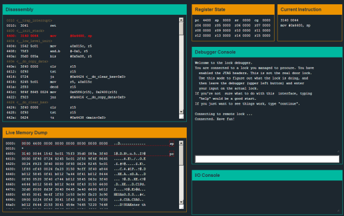
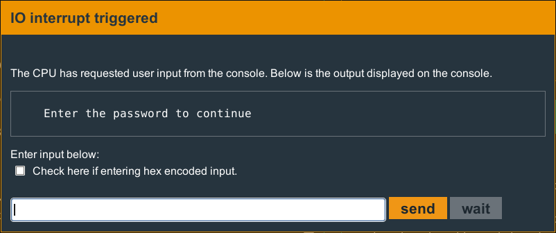
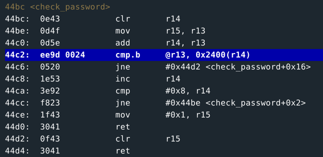
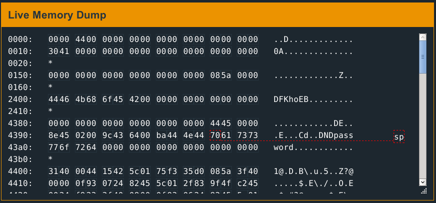
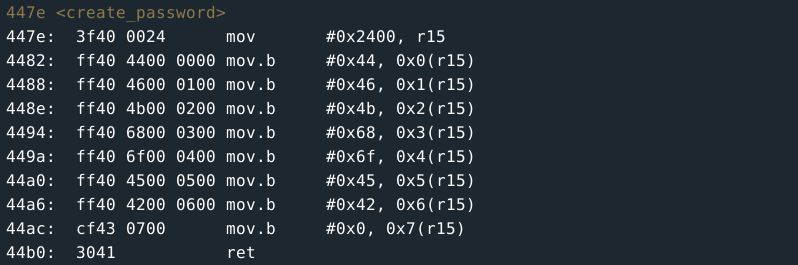

# RE-ECRIRE CA !!

# Micro Corruption write up

# Level 2: New Orleans



[MicroCorruption](http://microcorruption.com/) is a "game" made by **Matasano** in which you will have to debug some programs in **assembly**. There is a total of 19 levels and each one is harder and harder. The first levels are made for begginners though! So it seems like a great tool to learn.

I didn't know anything about **asm** (assembly) prior to this so I will try to document my journey in this challenge.

**Level 1, New Orleans** is supposed to be easy.

MicroCorruption comes with a nice debugger. Writing `c` (as *continue*) in the **debugger console** runs the program and allows you to try a password.



Of course entering *password* doesn't work. let's type `reset` in the console and try again. The debugger creates a **breaking point** automatically after the pop-up.

After a few `n` (next instruction) we end up in a `check_password` function. Obviously it is checking if the password is correct. This is where it starts.



Some explanations on the window:

* on the left you can see the addresses in the memory of each instructions. They are written in base 16 (1 means 8bits) and each instruction seems to take a different size.

* after this you can see the instruction written in hexadecimal directly. It's not very useful, at least at this level.

* then you have the instruction that consists of an **opcode** (`clr` on the first line) along with its **arguments**.

What the function does is basically this:

```c
r14 = 0;
r13 = r15; // r13 points to something
r13 += r14; // we add r14 to the address in r13
if(*r13 == *(0x2400 + r14)){
    r14++;
    if(r14 != 8){
        // go back to the r13 += r14 line
    }
    else{
        r15 = 1;
        return;
    }
}
else{
    r15 = 0;
    return;
}
```

> So we compare what's in r13 with what's in address 0x2400.  
Then we compare the next byte, and on and on for 7 bytes.  

We can see later in the code that if `r15 = 0` it's a bad thing, and if it equals `1` then we're done!  
At this point we can easily guess that what is at the address 0x2400 and of length 7 bytes must be the password.  



The live **memory dump** gives us a string. We enter it as the password: it works!  
We couldn't see that without running the program because the password was created during runtime, we can see the function that does that here:

