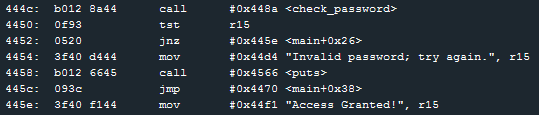
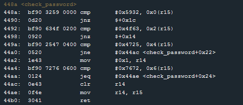

# Level 3: Sydney

## Observations

Let's quickly check the code. We can see that it looks a lot like level 1. We have a `check_password` function that has to change `r15` to something which is not zero.

Alright let's look at `check_password` shall we?

	

So `0x5932` (the `0x` part means we write in hexadecimal!) is getting compared against r15. Since **MSP430** is 16 bits, instructions like `cmp` compare 16bits by default.  
Then we compare `0x4f63` with `0x2(r15)` which means the content at address r15 + 2 bytes.  
And on and on. Bad comparisons at every step makes the program jumps and set r15 to zero which we don't want.  
  
Note that there are two different jumps here:
* Relative jumps: `jnz $+0x14` (using the relative instruction located at "current instruction + 0x14")
* Absolute jumps: `jne #0x44ac` (using the absolute address of the instruction at "0x44ac")

Note number 2:
* jnz: Jump if not zero. If the previous comparison checks it should change some flag to zero and the jnz should not work.
* jne: Jump if not equal. Same principle.

At this point we could **guess** that the password is something like `0x59324f6347257672`

Well. Curiously this does not work. After a bit of research, maybe we are in [little-endian](http://en.wikipedia.org/wiki/Endianness)?  

Trying `0x3259634f25477276` it works!

Basically what the `cmp` opcode does is slicing the 2 bytes we feed it in chunks of size 1 byte and ordering them accordingly to our system's endianness. So here it would be in reverse order.