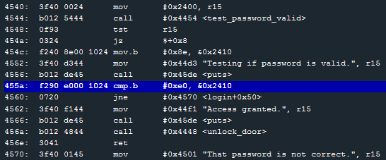

# Level 3: Hanoi

We know how this works now, let's go straight for the *"That password is not correct."* line. Scrolling through the [code] we can see that a comparison of byte between the value `#0xe0` (224) and the content at address `0x2410`, if it is not equal the program jumps to address login+0x50. In the Debugger Console we type `r login+50` to read the memory at this address. We can see that it is indeed the line 4570 of the memory which is our *"That password is not correct."* line.

What's at address `0x2410`?

