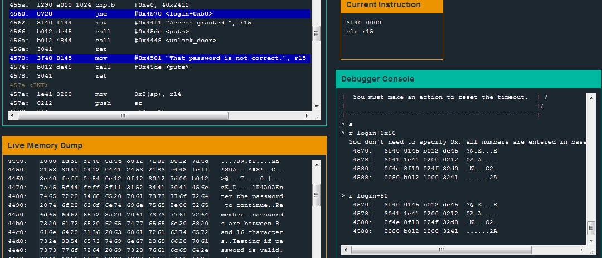

# Level 4: Hanoi

## Observations

We know how this works now, let's go straight for the *"That password is not correct."* line. Scrolling through the [code] we can see that a comparison of byte between the value `0xe0` (224 in decimal) and the content at address `0x2410`, if it is not equal the program jumps to address login+0x50. In the Debugger Console we type `r login+50` to read the memory at this address. We can see that it is indeed the line 4570 of the memory which is our *"That password is not correct."* line.

We see that just a few steps ahead, the code sets the byte at `0x2410` to `0x8e`. That is different from `0xe0` so the test will inconditionnally fail. Fortunatelly this is avoided if we jump this instruction. That's exactly what is happening if `tst r15` works. Does it?

* I set a break point in this instruction with `b 454a`.
* I run the program with `c` until it goes to my breakpoint.
* I then `step` instructions to see that it does makes the jump eventhough I entered an incorrect password.

So the `mov.b #0x8e, &0x2410` line is just here to confuse us.

## test_password_valid

Just before calling `test_password_valid` (that seems to be the function that checks for the correctness of our password) we seem to move the value `0x2400` in the `r15` register. What's there?

* I set a break point in this instruction with `b 4540`
* I run the program with `c`
* I enter some dumb value in the password field and I continue to my breakpoint
* Once I'm there I check what's in 0x2400 with `r 2400`, I get the dumb value I entered.

So `r15` contains the address where the password I entered is located. `2400` is the address where the password is located.

## what if?

What if I entered a password long enough to reach the address `2410` so I could put the `0xe0` value there and my work would be done?

>Let's remember. An address contains 1 byte, so we have to write 1 byte of password to reach the next address. In hexadecimal that's two letters.

Let's try to enter `0xaaaaaaaaaaaaaaaaaaaaaaaaaaaaaaaae0`. **It works!**