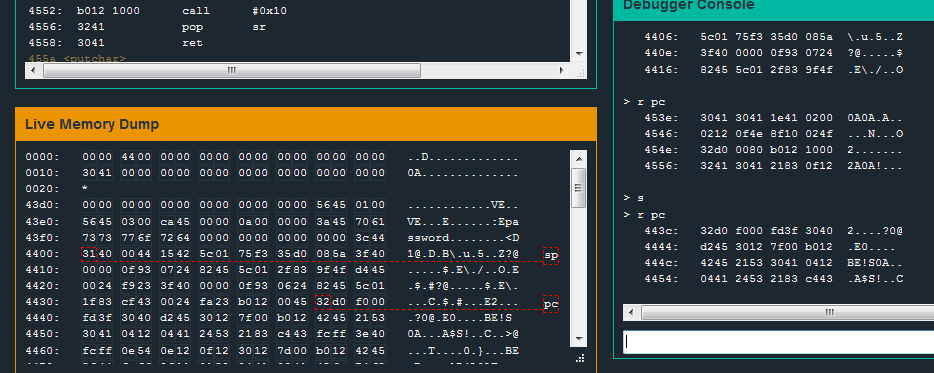

# Level 5: Cusco

## Let's start

> We have fixed issues with passwords which may be too long.

The message greeting us is quickly confirmed by a test. If we try to enter a long password it only stores its first 48 bytes in the stack.

We also see that if we run the program with a long password it stops running correctly after a certain line: the return instruction `ret` of the function `login`. It seems we have overwrote the instructions. A quick look at the program counter (`r pc 8`) shows that the next instructions are all zeros.

The `ret` instruction of a function takes the last value in the stack and loads it into the Program Counter `pc` ([also called the Instruction Pointer `ip` in intel x86](http://en.wikipedia.org/wiki/Program_counter)).
What we did was overwriting the stack (**stack overflow**) until it reached what we call the **saved pc** of the function (the instruction that is supposed to run after calling the function).

## Where is the value we have to change?

Okay, so where exactly is this return value we have to change? I will enter "password" as input so I can quickly find it in the memory. Also let's add a breakpoint on the `ret` instruction and see what is the SP (stack pointer) pointing on.

Here we see that `pc` was pointing to `453e`, and after the return it points to address `443c` in memory, which was indeed the last 16bits entry of the stack, located 8bytes after our "password" (we can see that in the Live Memory Dump). Now we know that if we enter a password where the 16th byte is 0xaabb, the program will load the instruction located at address 0xbbaa in memory (remember, we are in little endian).

## What should we load?

What about that function called `unlock_door`? Let's try to jump to that and see if it does what it says.

Let's try with that password: `0xaaaaaaaaaaaaaaaaaaaaaaaaaaaaaaaa4644`

**It works!**