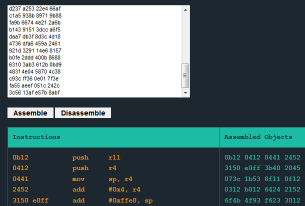
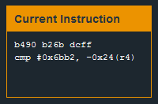

# Level 6: Reykjavik

## Quick look

We run the program and hodiho! It seems like at one point our `pc` gets lost in the stack and doesn't follow the initial path.

Entering a large number of the same letter we see that they get stored at address `43da` in memory.

## Encryption

If you look at the code, you can see that all `enc` does is looping and modifying bits of memory. Basically what it does is **building instructions** that we will read afterward by **pointing the Program Counter on them**. It's mostly incomprehensible so let's not waste time with this. `r pc 100` gives us the hexadecimal code that we can then Disassemble through Microcorruption Disassembler, or we can just step through it and observe what is really happening through the Current Instruction window.

Let's run the code until we get prompted by the pop-up asking for a password. We can then check that it gets saved into the stack (`r sp`). Then let's follow the code step by step with `s`. The PC is now following instructions in the stack (which is normally not possible if the system is protected with the NX bit which prevents the heap and the stack to be executed).

Right after the popup, this code appears:

The instruction compares `0x6bb2` with what is at the address pointed by `r4`, minus 24 bytes. Magically, this is where our password is stored. Remember, **the instruction `cmp` compares 16bits in MSP430**, so the password starts like this: `0xb26b` (remember we are in **little endian**!). Stepping through the code we don't see anymore `cmp`. Let's try this value as a password. **It works!**