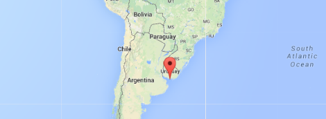

# Level 8: Montevideo

## Observations

We can enter a 3x16bytes password (same as previous level).
The program uses strcpy and memset (this is new).
We have a stack overflow after 16 bytes (like the previous level).
So let's try entering the exact same password *aaaaaaaaaaaaaaaaaaaaaaaaaaaaaaaa60447f*.

It works...

(I think it comes from the use of strcpy, it copies until it finds a \0 but we can still overflow the stack, buffer overflow, particularly a stack overflow. This is stack smashing because we change the RIP (return instruction pointer) here maybe it would be called RPC (return program counter?))

(The function copies a supplied string without bounds checking by
using strcpy() instead of strncpy(). (http://insecure.org/stf/smashstack.html))