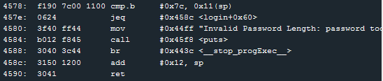

# Level 9: Johannesburg

## Quick Look

There is now a security against passwords that exceed a certain number of letters, but the security happens after storing it in stack so we can still store a longer password than expected. The maximum possible seems to be 37bytes. But the last `ret` is avoided by a `br` (branch to destination) and the program is shut down early, so no stack overflow here.

## How is the password's length checked?

Seems like a password of length superior than 17 bytes is too much, to test the security of this it just checks if the value located after the 17byte password in the stack is 0x7c, a value that is supposed to be here.
`cmp.b   #0x7c, 0x11(sp)`

Here's the trick, if we set the 18th byte of our password to 0x7c then it will work!

We can then jump to the call interrupt and set the last byte of the stack to 0x7f like we did in the previous levels:

the password *aaaaaaaaaaaaaaaaaaaaaaaaaaaaaaaaaa7c6c447f* works.