# Level 1: Tutorial


[MicroCorruption](http://microcorruption.com/) is a "game" made by **Matasano** in which you will have to debug some programs in **assembly**. There is a total of 19 levels and they get harder and harder, teaching you about more advanced attacks and ways of mitigating them. The first levels are easy and there is even a tutorial that takes you step by step into this world. It is a great tool to learn and I would even say a great game to play. As I had never done any **asm** (assembly) prior to this, I will try to document my journey in this challenge.

# Level 2: New Orleans


MicroCorruption comes with a nice debugger. Writing `c` (as *continue*) in the **debugger console** runs the program and allows you to try a password.


Of course entering *password* as password doesn't work. let's type `reset` in the console and try again. The debugger creates a **breaking point** automatically after the pop-up by the way.

After a few `n` (next instruction) we end up in a `check_password` function. Obviously it is checking if the password is correct. This is where it starts.


Some explanations on the desassembly here:

* On the left you can see the addresses in the memory for each instructions. They take 16 bits of space (so we are not in a 32 or 64 bits system) and they are written in base 16 for more conveniance. 1 bit in the address maps to 1 byte of code. Also an instruction's size can vary from 1 byte to many bytes.

* After the address of the instruction you can see the instruction in hexadecimal (`0e43` on the first line). It's not very useful, at least at this level.

* Following the hexadecimal form of the instruction you have the assembly form of it. Comprised of an **opcode** (`clr` on the first line) and its **arguments** (`r14` on the first line).

In the function `check_password` the program plays with registers. Those are just place near the CPU that can be accessed very fast. You can put **one word** of anything you want in it, be it a pointer or a value. A **word** represents the space in memory you can allocate. MSP430 is a 16 bits system so a word is 16 bits.

There are other ways (and slower ways) to store and retrieve data in code execution. But we'll only work with register for this second level. Here's what the code would do if disassembled in a language more familiar (that looks like C):

```
function check_password:

r14 = 0; // clr r14
r13 = r15; // mov r15, r13
r13 += r14; // add r14, 13
// cmp.b @r13, 0x2400 and jne #0x44d2
// we compare only one byte and not an entire word
if(*r13 & 0x01 == *(0x2400 + r14) & 0x01)
{
    r14++; // inc r14
    // cmp #0x8, r14 and jne #0x44be
    // here we use cmp and not cmp.b so we compare an entire word (16 bits in MSP430)
    if(r14 != 8)
    { 
        goto check_password + 2; // go back to the mov r13 = r15 line
    }
    else
    {
        r15 = 1; // mov #0x1, r15
        return; // ret
    }
}

r15 = 0; // clr r15
return; // ret
```

> So we compare one byte of what's in r13 with one byte of what's in address r14 + 2400 (which is address 2400 since we did a `clr r14`).
Then we compare the next byte, and on and on, for 8 bytes. Then it sets r15 to 1 and return. Otherwise r15 is set to zero.

We can see later in the code that if `r15 = 0` it's a bad thing, and if it equals `1` then we're done!  
At this point we can easily guess that what is at the address 0x2400 and of length 7 bytes (followed by the \0 terminating character) must be the password. 


The live **memory dump** gives us a string. We enter it as the password: it works!  
We couldn't see that without running the program because the password was created during runtime, we can see the function that does that here:


# Level 3: Sydney


## Observations

Let's quickly check the code. We can see that it looks a lot like level 1. We have a `check_password` function that has to change `r15` to something which is not zero.

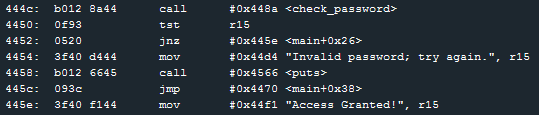

Alright let's look at `check_password` shall we?

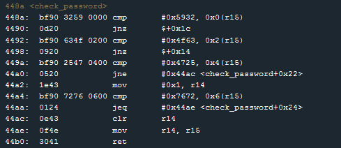	

So `0x5932` (the `0x` part means we write in hexadecimal!) is getting compared against r15. Since **MSP430** is 16 bits, instructions like `cmp` compare 16bits by default.  
Then we compare `0x4f63` with `0x2(r15)` which means the content at address r15 + 2 bytes.  
And on and on. Bad comparisons at every step makes the program jumps and set r15 to zero which we don't want.  
  
Note that there are two different jumps here:
* Relative jumps: `jnz $+0x14` (using the relative instruction located at "current instruction + 0x14")
* Absolute jumps: `jne #0x44ac` (using the absolute address of the instruction at "0x44ac")

Note number 2:
* jnz: Jump if not zero. If the previous comparison checks it should change some flag to zero and the jnz should not work.
* jne: Jump if not equal. Same principle.

At this point we could **guess** that the password is something like `0x59324f6347257672`

Well. Curiously this does not work. After a bit of research, maybe we are in [little-endian](http://en.wikipedia.org/wiki/Endianness)?  

Trying `0x3259634f25477276` it works!

Basically what the `cmp` opcode does is slicing the 2 bytes we feed it in chunks of size 1 byte and ordering them accordingly to our system's endianness. So here it would be in reverse order.

# Level 4: Hanoi


## Observations

We know how this works now, let's go straight for the *"That password is not correct."* line. Scrolling through the [code] we can see that a comparison of byte between the value `0xe0` (224 in decimal) and the content at address `0x2410`, if it is not equal the program jumps to address login+0x50. In the Debugger Console we type `r login+50` to read the memory at this address. We can see that it is indeed the line 4570 of the memory which is our *"That password is not correct."* line.


We see that just a few steps ahead, the code sets the byte at `0x2410` to `0x8e`. That is different from `0xe0` so the test will inconditionnally fail. Fortunatelly this is avoided if we jump this instruction. That's exactly what is happening if `tst r15` works. Does it?

* I set a break point in this instruction with `b 454a`.
* I run the program with `c` until it goes to my breakpoint.
* I then `step` instructions to see that it does makes the jump eventhough I entered an incorrect password.

So the `mov.b #0x8e, &0x2410` line is just here to confuse us.

## test_password_valid

Just before calling `test_password_valid` (that seems to be the function that checks for the correctness of our password) we seem to move the value `0x2400` in the `r15` register. What's there?

* I set a break point in this instruction with `b 4540`
* I run the program with `c`
* I enter some dumb value in the password field and I continue to my breakpoint
* Once I'm there I check what's in 0x2400 with `r 2400`, I get the dumb value I entered.

So `r15` contains the address where the password I entered is located. `2400` is the address where the password is located.

## what if?

What if I entered a password long enough to reach the address `2410` so I could put the `0xe0` value there and my work would be done?

>Let's remember. An address contains 1 byte, so we have to write 1 byte of password to reach the next address. In hexadecimal that's two letters.

Let's try to enter `0xaaaaaaaaaaaaaaaaaaaaaaaaaaaaaaaae0`. **It works!**

# Level 5: Cusco


## Let's start

> We have fixed issues with passwords which may be too long.

The message greeting us is quickly confirmed by a test. If we try to enter a long password it only stores its first 48 bytes in the stack.

We also see that if we run the program with a long password it stops running correctly after a certain line: the return instruction `ret` of the function `login`. It seems we have overwrote the instructions. A quick look at the program counter (`r pc 8`) shows that the next instructions are all zeros.

The `ret` instruction of a function takes the last value in the stack and loads it into the Program Counter `pc` ([also called the Instruction Pointer `ip` in intel x86](http://en.wikipedia.org/wiki/Program_counter)).
What we did was overwriting the stack (**stack overflow**) until it reached what we call the **saved pc** of the function (the instruction that is supposed to run after calling the function).

## Where is the value we have to change?

Okay, so where exactly is this return value we have to change? I will enter "password" as input so I can quickly find it in the memory. Also let's add a breakpoint on the `ret` instruction and see what is the SP (stack pointer) pointing on.

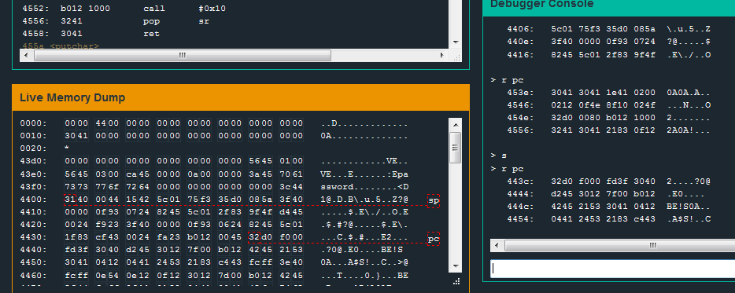

Here we see that `pc` was pointing to `453e`, and after the return it points to address `443c` in memory, which was indeed the last 16bits entry of the stack, located 8bytes after our "password" (we can see that in the Live Memory Dump). Now we know that if we enter a password where the 16th byte is 0xaabb, the program will load the instruction located at address 0xbbaa in memory (remember, we are in little endian).

## What should we load?

What about that function called `unlock_door`? Let's try to jump to that and see if it does what it says.

Let's try with that password: `0xaaaaaaaaaaaaaaaaaaaaaaaaaaaaaaaa4644`

**It works!**

# Level 6: Reykjavik


## Observations

We run the program and hodiho! It seems like at one point our `pc` gets lost in the stack and doesn't follow the initial path.

Entering a large number of the same letter we see that they get stored at address `43da` in memory.

## Encryption

If you look at the code, you can see that all `enc` does is looping and modifying bits of memory. Basically what it does is **building instructions** that we will read afterward by **pointing the Program Counter on them**. It's mostly incomprehensible so let's not waste time with this. `r pc 100` gives us the hexadecimal code that we can then Disassemble through Microcorruption Disassembler, or we can just step through it and observe what is really happening through the Current Instruction window.


Let's run the code until we get prompted by the pop-up asking for a password. We can then check that it gets saved into the stack (`r sp`). Then let's follow the code step by step with `s`. The PC is now following instructions in the stack (which is normally not possible if the system is protected with the NX bit which prevents the heap and the stack to be executed).

Right after the popup, this code appears:


The instruction compares `0x6bb2` with what is at the address pointed by `r4`, minus 24 bytes. Magically, this is where our password is stored. Remember, **the instruction `cmp` compares 16bits in MSP430**, so the password starts like this: `0xb26b` (remember we are in **little endian**!). Stepping through the code we don't see anymore `cmp`. Let's try this value as a password. **It works!**

# Level 7: Whitehorse


## Observations

We quickly test our program and see that we can enter a password of maximum 48 bytes and that we have a **stack overflow** after a length of 16 bytes.

The Program jumps to the address located in the bytes number 17 and 18 of our password, this occurs after the Interrupt that checks our password. 

## Where should we jump?

The program uses **HSM-2** to check the password. We don't have access to it. In the **LockIT Pro Manual** we can read:

> **INT 0x7F.**
> Interface with deadbolt to trigger an unlock if the password is correct.
> Takes no arguments

We just have to call a **0x7F interrupt**. To tell that to the program we have to simulate the `push #0x7F` so that the interrupt would work.

If we enter this password: `aaaaaaaaaaaaaaaaaaaaaaaaaaaaaaaa60447f`

When the `ret` will occurs, it will set the Program Counter to `4460` (where the Stack Pointer is). Then the SP will move to the value `7f` which will be taken as an argument when the interrupt will happen. That's exactly what we want, and it works.

# Level 8: Montevideo


## Observations

We can enter a 3x16bytes password (same as previous level).
The program uses strcpy and memset (this is new).
We have a stack overflow after 16 bytes (like the previous level).
So let's try entering the exact same password *aaaaaaaaaaaaaaaaaaaaaaaaaaaaaaaa60447f*.

It works...

(I think it comes from the use of strcpy, it copies until it finds a \0 but we can still overflow the stack, buffer overflow, particularly a stack overflow. This is stack smashing because we change the RIP (return instruction pointer) here maybe it would be called RPC (return program counter?))

(The function copies a supplied string without bounds checking by
using strcpy() instead of strncpy(). (http://insecure.org/stf/smashstack.html))

# Level 9: Johannesburg


## Quick Look

There is now a security against passwords that exceed a certain number of letters, but the security happens after storing it in stack so we can still store a longer password than expected. The maximum possible seems to be 37bytes. But the last `ret` is avoided by a `br` (branch to destination) and the program is shut down early, so no stack overflow here.

## How is the password's length checked?

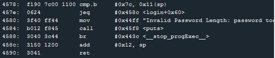

Seems like a password of length superior than 17 bytes is too much, to test the security of this it just checks if the value located after the 17byte password in the stack is 0x7c, a value that is supposed to be here.
`cmp.b   #0x7c, 0x11(sp)`

Here's the trick, if we set the 18th byte of our password to 0x7c then it will work!

We can then jump to the call interrupt and set the last byte of the stack to 0x7f like we did in the previous levels:

the password `aaaaaaaaaaaaaaaaaaaaaaaaaaaaaaaaaa7c6c447f` works.

# Level 10: Santa Cruz


## First protection

We try entering a long username and password and we get directly kicked out of the program at line 460c. The program seems to check address r4-19 (0x43b3) and compare it with r11. If it doesn't match then it exits.

**The r11 register seems to hold the password length.**


`jc` Jump on Carry, similar to Jump if Below (*JB*) or Jump if Not Above or Equal (`JNAE`)

We can circumvent that if what is at address `0x43b3` is **below than the password's length**.

We check this address to see that it's overflowed by the **username** we entered. We can set the 18th byte of the username to something lower than the password length and it will pass the test.

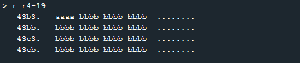

>here I entered a series of *a*'s as username, and a series of *b*'s as password.

## Second protection

We get kicked a second time but at a different line (45f6).


`jnc` Jump No Carry, equivalent to Jump if Not Below (JNB)  or **Jump if Above or Equal** (JAE). So we jump if the byte at address `0x43b4` **is not below the password's length**. This address can be modified by the 19th byte of the username.

>Note that the initial values are respectively 8 and 10, meaning that they expected us to enter a password greater than 8 and lesser than 11 characters.

## Third protection

We get halted one last time at line 0x465a.


`tst.b -0x6(r4)`: if the byte at address r4 - 6 (`0x43c6`) is not zero, it will exit. This is very important as this is one of the first occurence of a real world way to prevent attacks on a program. It is called a **Canary**. It checks for values in the code and detect buffer overflows if the value is incorrect. Here it checks the byte we overflowed with the 18th byte of the password we entered.

Thus, this combination of username and password should pass the three tests we described:

## Stack Overflow

We passed all the test and couldn't produce a stack overflow with the password. Did I miss something? Let's try with the username

username: aaaaaaaaaaaaaaaaaaaaaaaaaaaaaaaaaa01ffaaa [...] aaa
password: bbbbbbbbbbbbbbbbbbbbbbbbbbbbbbbbbb00

That's the solution. The Stack Pointer points to some remains of the username right before executing the last `ret` of our program. We can now do a stack overflow by modyfing the 43th byte of the username to the address we want to jump to.

We use the 7F call interrupt technique of the previous challenge.

username: aaaaaaaaaaaaaaaaaaaaaaaaaaaaaaaaaa01ffaaaaaaaaaaaaaaaaaaaaaaaaaaaaaaaaaaaaaaaaaaaaaa72447f
password: bbbbbbbbbbbbbbbbbbbbbbbbbbbbbbbbbb00

**It works!**


# Level 11: Jakarta


## First protection

Entering different usernames we see that **r11 is the username's length**.
Look at the instruction `cmp.b #0x21, r11` 


>`jnc` ~ Jump if Above or Equal

So we pass the first test if **the username's length is lesser than 33 bytes** (0x21).


## Second protection

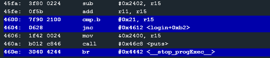

```
add r11, r15
cmp.b #0x21, r15
jnc
```

So **the sum of the username and the password lenghts** have to be lesser than 33 bytes as well (0x21).


## Stack Overflow

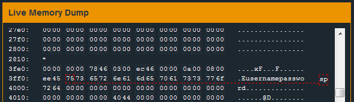

We see that the username and the password are stored in the stack thanks to the `strcpy`.

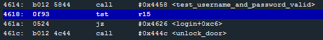

We see that the password is tested in the function `test_username_and_password_valid` through the 7d interrupt. So we cannot do anything here. It is obvious we need to create a stack overflow again.

But let's go back to our previous tests


Don't you see something? `cmp.b #0x21, r15`.
This means: compare byte of r15 and 0x21. But words are 2 bytes in MSP430 (so registers and address in the stack are 2 bytes).
What if we wrote 0x1020 for example. Would it be lesser than 0x21 ?

Let's try that.

I enter `aaaaaaaaaaaaaaaaaaaaaaaaaaaaaaaaaaaaaaaaaaaaaaaaaaaaaaaaaaaaaaaa` (length of 0x20) as username.

we want the toal to be 0x0100 to test our hypothesis. So we need 0xd0 more (14 * 16 = 224 bytes).

Entering `bbbbbbbbbbbbbbbbbbbbbbbbbbbbbbbbbbbbbbbbbbbbbbbbbbbbbbbbbbbbbbbbbbbbbbbbbbbbbbbbbbbbbbbbbbbbbbbbbbbbbbbbbbbbbbbbbbbbbbbbbbbbbbbbbbbbbbbbbbbbbbbbbbbbbbbbbbbbbbbbbbbbbbbbbbbbbbbbbbbbbbbbbbbbbbbbbbbbbbbbbbbbbbbbbbbbbbbbbbbbbbbbbbbbbbbbbbbbbbbbbbbbbbbbbbbbbbbbbbbbbbbbbbbbbbbbbbbbbbbbbbbbbbbbbbbbbbbbbbbbbbbbbbbbbbbbbbbbbbbbbbbbbbbbbbbbbbbbbbbbbbbbbbbbbbbbbbbbbbbbbbbbbbbbbbbbbbbbbbbbbbbbbbbbbbbbbbbbbbbbbbbbbbbbbbbbbbbbbbbbbbbbbbbbbbbbbbbbbbbbbbbbbbbb` it works and we get lost at a random address. We've successfully overwrote the return address.

Breaking on the return instruction we can see at what address the Saved PC is (at the SP address).

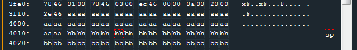

So we can enter our personalized return address at the byte number 5 and 6 of our password (if our username is of length 0x20 of course). Let's return at the instruction `unlock_door`.

So entering the same username, and this as password works:

`bbbbbbbb1c46bbbbbbbbbbbbbbbbbbbbbbbbbbbbbbbbbbbbbbbbbbbbbbbbbbbbbbbbbbbbbbbbbbbbbbbbbbbbbbbbbbbbbbbbbbbbbbbbbbbbbbbbbbbbbbbbbbbbbbbbbbbbbbbbbbbbbbbbbbbbbbbbbbbbbbbbbbbbbbbbbbbbbbbbbbbbbbbbbbbbbbbbbbbbbbbbbbbbbbbbbbbbbbbbbbbbbbbbbbbbbbbbbbbbbbbbbbbbbbbbbbbbbbbbbbbbbbbbbbbbbbbbbbbbbbbbbbbbbbbbbbbbbbbbbbbbbbbbbbbbbbbbbbbbbbbbbbbbbbbbbbbbbbbbbbbbbbbbbbbbbbbbbbbbbbbbbbbbbbbbbbbbbbbbbbbbbbbbbbbbbbbbbbbbbbbbbbbbbbbbbbbbbbbbbbbbbbbbbbbbbbbbbbbbbbbbbbbb`

# Level 12: Addis Ababa


## Quick observations

* The password is tested through `test_password_valid` with a 7d interrupt (HSM Model 1).
* We have an `unlock_door` function (so no need to go through the `test_password_valid` function if we can return to it).(44da)
* We have no `ret` after the main (so we can't modify the return address).
* If the SP is different from zero the program unlocks the doors.
* We have a printf of our username (**format string vulnerability**!)

## Printf in Manual

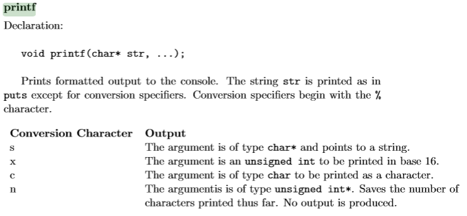

We see that printf is a limited version of the C equivalent. Since we have %n available we know we can write to the memory and thus we should be able to do a Format String exploit.


So here the developer did a:

`printf(user_input);`

instead of this: 

`printf("%s", user_input);`

So the user_input becomes the format string and it will look in the stack for its arguments (in the example red, 123456, and ... are pushed in the stack).

## Printf in MSP430

Let's try `%x` as input. It doesn't output anything. So the first argument must be null:

`printf(user_input, 0x00);`

Let's try again with `%x %x`. It outputs `7825` which is `%x` reversed (little endian). It seems like when we point to our second arguments we are pointing to the beginning of our input. Since a word is 16bits in MSP430 we only display 2 characters in hexadecimal.

So if we enter `PTR%x%n` we will write 5 to the address in PTR.
note that we can use %x, %c, %n... as our first format since we won't use it.

## Exploit

Remember what we observed at the begginning:

> If the SP is different from zero the program unlocks the doors.

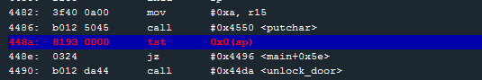

It was at this line. And by breaking on it we can see that sp is pointing to 3062.

So let's try to do `6230256e256e`

which should write the number of characters printed before the last %n (which will be only 2 since the first %n won't count).

# Level 13: Novosibirsk


## Observations

* Printf again, except this time the first argument is the user input (a simple `%x` returns `7825`)
* No main ret.
* Call to `conditional_unlock_door` (HSM-2)

## Format String Again

The obvious idea here is to change the 7E interrupt to a 7F interrupt. Let's try the to exploit the Format String to do that. 

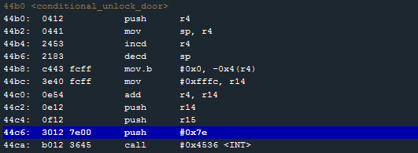

So let's build our input:
* the address we want to write on (here `c844` (little endian)). 
* Then enough padding to print 7f (127) bytes including the 4 bytes of the address we're writing on.
* The format %n

`c8446161616161616161616161616161616161616161616161616161616161616161616161616161616161616161616161616161616161616161616161616161616161616161616161616161616161616161616161616161616161616161616161616161616161616161616161616161616161616161616161616161616161256e`

This works.

# Level 14: Algiers


## Observations

* Use of the **malloc** function. Hints at a **Heap Overflow Exploit**.
* There are two functions that can unlock this level:  `unlock_door` and `test_password_valid`.
* There seem to be no check on the username and password length. We can enter 18 bytes in username and then it gets overwritten by password.
* With a quick test entering a long string of the same letter as username and as password we get an error : **load address unaligned: UU75** where UU is the character we entered in the username.
* One character in username input gets changed to ` during the password verification (at address 2422 in memory).
* The buffer overflow stops us at line 0x4520 (in the `free` function).


In the Manual we find: 

> BIT arg1 arg2 -> compute arg1 & arg1, set the flags, and discard the results (like TEST on x86)

Also it seems good to keep being aware that in MSP430 the Heap grows toward the Stack and the Stack towards the Heap.

0000 low addresses
HEAP v

STACK ^
Text v
ffff high addresses

## login

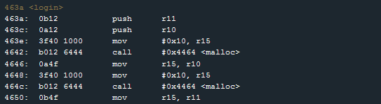

Looking at the login function we see that it's doing two malloc of size 10 and is storing the username in the first malloc contained at r10, and the password in the second malloc r11.

After retrieving the user's credentials and storing them in the heap. The program calls `test_password_valid` and unlocks the door or not according to the validity of the username and the password.

Looking at the test_password_valid we see an early `ret` followed by a long list of what seems like gibberish opcodes.

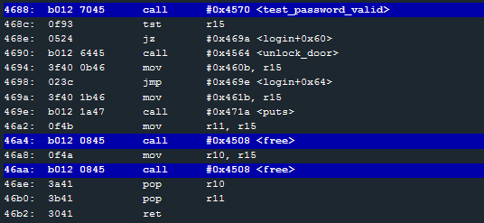

Later the login function frees the two mallocs.

But let's see what really happens. We can see the heap before the mallocs:

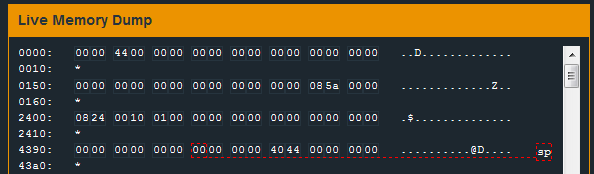

The heap after the first malloc:


The heap after the second malloc:

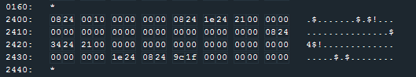

The heap after entering "username" as username:


The heap after entering "password" as password:


Here we can see the memory after the first free:

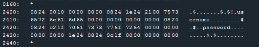

And the memory after the second free:

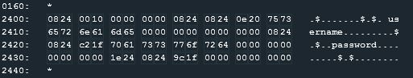


## Heap Structure.


The Heap is a **doubly-linked list**. Each chunk is composed of **metadatas** and a **payload**. The chunks are wraped with a heap header and a heap footer. Here we can see the structure of a chunck:

```
0824 | 1e24 | 21 00 | username | 00...
 bk  |  fw  | flag  | payload  | padding
```

And what is interesting:

* bk (backward): a pointer to the previous chunck
* fw (forward): a pointer to the next chunck

The second chunck starts at address `241e` and contains the password. The idea of a heap overflow is to **overwrite the metadatas** of this second chunck when filling the payload of the first one. Because when free is called to remove this chunck, it will do some magic with the fw and bk pointers so the chain can reconstruct around the chunck.


## Try to exploit this

So let's change overwrite the second chunck with our username input. I tried multipled things:
* Set fw to the saved pc in the stack right before the return of the login function, set bk to the address where login calls unlock_door.
* Set fw to the address being called in the second free, set bw to the unlock_door function.
* Set fw to the instruction return in the free function, set bw to Nops so we would go directly in the unlock_door function afterwards.

It failed for different reasons. It was overwritting things at the bw pointer. It was not working because of parity problems. Reversing the function did help understand that what we would point with fw would influence the overwriting.

Here is a smart reverse of the function `free`. It was thought so I could see how changing bk, fw and the flag would influence the free. So this is not exactly what the free function does! I also remove useless lines.

```
exploitable_free(*bk, *fw, *flag){
	// the flag is modified if not even
	if(*flag % 2 == 1)
		*flag = *flag - 1;
	r14 = bk;
	r12 = *(bk + 4);

	// we do this if the previous chunk's flag is even
	// which is not because it's not the first one?
	if(r12 % 2 == 0){
		// not executed
	}

	r14 = fw;
	r13 = *(fw+4);

	// r13 : 1f9c (dunno if we can rewrite that far away)
	// c : 1100
	// so we do this if
	if(r13 % 2 == 0){
		*flag = r13 + *flag + 6;
		fw = *(r14+2); // interesting!
		*fw = bk;
	}

	return;
}
```

In the end I tried to make a shell code. I copied the instructions in unlock_door:

```
3012 7f00 b012 b646 fd3f
```

And I pointed the saved pc to the heap (which is supposed to be non-executable on a protected system but here it worked!).

Also, to counter the overwritting problem I made a NOP slide. Here's the solution:

`909090909090 3012 7f00 b012 b646 fd3f 0e24 9a43`


